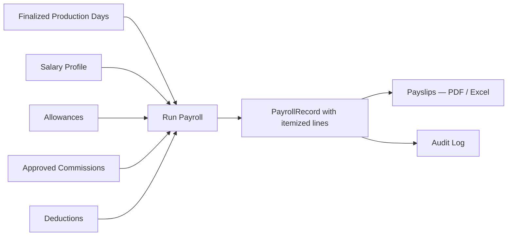

# MetroWage

<div align="center">

<!-- Demo Video -->
https://github.com/a11powerai/metrowage/blob/master/videos/metrowage_full_verify_1772124392829.webp

**Factory Production & Integrated Payroll Management System**

Built with Next.js 16 · Prisma 5 · SQLite · NextAuth.js · Tailwind CSS · Recharts

[](https://nextjs.org/)
[](https://www.prisma.io/)
[](https://www.typescriptlang.org/)
[](LICENSE)

</div>

---

## 🧭 Overview

MetroWage is a complete end-to-end factory management platform that combines:
- **Production incentive tracking** — daily piece-rate production with slab-based earnings
- **Integrated payroll** — assembly earnings auto-pulled into full salary payroll with itemized payslips

---

## ✨ Features

### 🏭 Production Module
| Feature | Description |
|---------|-------------|
| **Workers** | Worker ID, Name, Status CRUD |
| **Products** | Product catalog management |
| **Incentive Slabs** | Per-product quantity-to-rate slabs (overlap validation) |
| **Daily Production Entry** | Worker × Product × Quantity; live slab preview |
| **Auto Calculation** | Applicable slab rate applied to full day quantity |
| **Day Finalize / Unlock** | Lock a production day; SuperAdmin can unlock |

### 📊 Reports
| Report | Exports |
|--------|---------|
| Daily Report — worker-wise breakdown | PDF + Excel |
| Monthly Report — worker totals + product production | Excel + Bar Chart |
| Yearly Report — month-wise trend | Excel + Line Chart |

### 💼 Payroll Module
| Feature | Description |
|---------|-------------|
| **Salary Profiles** | Basic salary, OT rate, worker type (Salary / PieceRate / Both) |
| **Allowances** | Monthly or one-time per worker |
| **Deductions** | Loan, Advance, Statutory, Penalty (auto-marked applied after use) |
| **Commissions** | Series-based; must be approved before payroll inclusion |
| **Run Payroll** | Auto-pulls finalized assembly earnings; generates itemized records |
| **Payslips** | Full itemized view with assembly breakdown per product; PDF + Excel |
| **Audit Log** | Every Generate and Finalize action is recorded |

**Net Pay Formula:**
```
Net Salary = (Basic + Overtime + Allowances + Commissions + Assembly Earnings) − Deductions
```

### 🔐 Role-Based Access
| Role | Permissions |
|------|-------------|
| **SuperAdmin** | Full access + User Management + Payroll |
| **Admin** | Workers, Products, Production, Payroll, Reports |
| **Supervisor** | Production Entry only |

---

## 🖥 Demo

<!-- Embedded app recording -->
> **Note:** The video below is a WebP recording of the browser verification session.


---

## 🚀 Getting Started

### Prerequisites
- Node.js 18+
- npm

### Installation

```bash
git clone https://github.com/a11powerai/metrowage.git
cd metrowage
npm install
```

### Environment Setup

Create a `.env` file in the project root:

```env
DATABASE_URL="file:./prisma/dev.db"
NEXTAUTH_SECRET="your-secret-here-change-this"
NEXTAUTH_URL="http://localhost:3000"
```

### Database Setup

```bash
npx prisma db push          # Create the SQLite database tables
npx ts-node -e "require('./prisma/seed')"   # Seed the SuperAdmin user
```

### Run Development Server

```bash
npm run dev
```

Open [http://localhost:3000](http://localhost:3000)

**Default Login:**
| Field | Value |
|-------|-------|
| Email | `superadmin@metromarqo.lk` |
| Password | `Admin@1234` |

> ⚠️ Change the default password after first login.

---

## 📁 Project Structure

```
metrowage/
├── app/
│   ├── api/
│   │   ├── auth/           # NextAuth.js handler
│   │   ├── workers/        # Workers CRUD API
│   │   ├── products/       # Products + Slabs API
│   │   ├── production/     # Production entry + finalize/unlock
│   │   ├── reports/        # Daily / Monthly / Yearly report APIs
│   │   ├── payroll/        # Profiles, Allowances, Deductions, Commissions, Periods
│   │   └── admin/          # User management API
│   ├── dashboard/          # All dashboard pages
│   │   ├── workers/
│   │   ├── products/
│   │   ├── production/
│   │   ├── reports/        # daily / monthly / yearly
│   │   ├── payroll/        # profiles / allowances / deductions / commissions / run / payslips
│   │   └── admin/users/
│   ├── login/
│   └── page.tsx            # Landing page
├── components/
│   └── Sidebar.tsx         # Role-aware navigation sidebar
├── lib/
│   ├── auth.ts             # NextAuth.js configuration
│   ├── calculations.ts     # Slab matching + incentive calculation
│   ├── prisma.ts           # Prisma client singleton
│   └── utils.ts            # Formatting utilities
├── prisma/
│   ├── schema.prisma       # Full database schema
│   └── seed.ts             # SuperAdmin seed
└── videos/                 # App demo recordings
```

---

## 🛠 Tech Stack

| Layer | Technology |
|-------|-----------|
| Framework | Next.js 16 App Router |
| Language | TypeScript 5 |
| Database | SQLite (via Prisma 5) |
| Auth | NextAuth.js v4 (JWT, Credentials) |
| UI | Tailwind CSS v4 |
| Forms | React Hook Form + Zod v4 |
| Charts | Recharts |
| Export | jsPDF + xlsx |
| Icons | Lucide React |

---

## 🔄 Payroll Flow



---

## 📄 License

MIT © 2026 MetroWage
